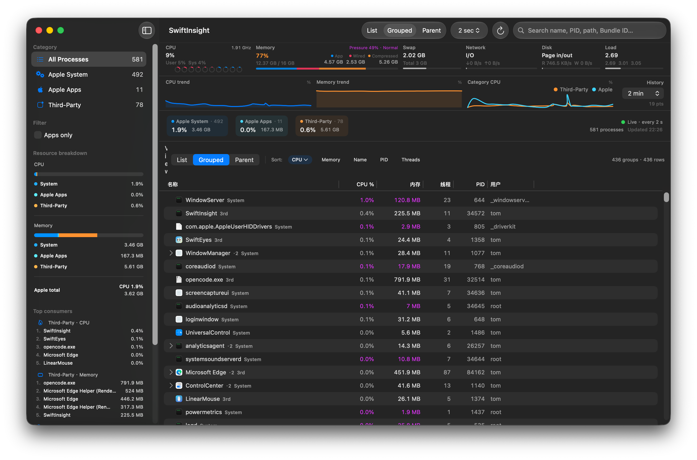
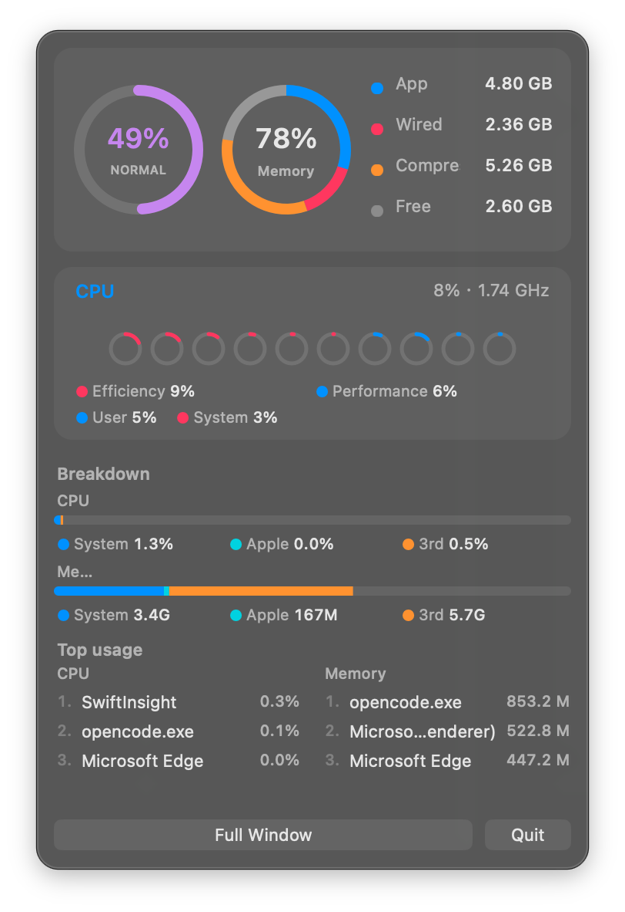

# SwiftInsight

[中文](README.zh-CN.md) · English

<p align="center">
  
</p>

> Built with Grok 4.5 / OpenCode vibe coding.

A lightweight **Activity Monitor alternative** for macOS, built with **Swift / SwiftUI**.  
Focus: **Apple vs third-party** resource breakdown, a stable **menu bar** panel, and optional **root helper** metrics.

<p align="center">
  
</p>

<p align="center">
  
</p>

## Features

### Process monitoring
- Live process list: CPU, memory, threads, user, PID, path, Bundle ID
- **Classification**
  - **Apple System** — kernel, launchd, daemons, `/System`, `/usr`, …
  - **Apple Apps** — `com.apple.*` / built-in apps
  - **Third-Party** — everything else
- Views: **flat list**, **app aggregation tree**, **parent/child tree**
- Search, category filters, sort, quit / force quit, Finder reveal

### System overview
- **CPU** — total use, user/system, per-core rings (E/P colors), adaptive layout for high core counts  
  Optional **frequency / temperature** via privileged helper
- **Memory** — app / wired / compressed / available, composition bar  
  **Memory pressure** aligned with Activity Monitor jetsam levels (`kern.memorystatus_vm_pressure_level`)
- Swap, network throughput, page in/out, load average
- History charts (CPU, memory, Apple vs third-party CPU)
- Category rankings (“who’s using resources”)

### Menu bar
- Status item with CPU / memory mini bars (CPU only / memory only / combined)
- Compact panel: pressure + memory rings, core strip, category breakdown (vs 100% / physical RAM), top processes
- Reliable positioning via `NSPanel` (use the packaged `.app`, not raw `swift run`)

### Preferences
- **Language**: System / 中文 / English  
- **Theme**: System / Light / Dark  
- Refresh interval; hold **⌃ Control** to pause auto-refresh  
- Optional **setuid root Helper** for protected-process metrics and sensors

## Requirements

- macOS 14+
- Xcode 15+ (or Swift 5.9+ with macOS SDK)
- Optional: [XcodeGen](https://github.com/yonaskolb/XcodeGen) to regenerate the project

## Build & run

### Recommended (menu bar works correctly)

```bash
./scripts/run-app.sh          # Debug .app and open
./scripts/run-app.sh Release
```

Do **not** use `swift run` to verify menu bar placement (no proper app bundle).  
Do **not** open `Package.swift` as a macOS Application.

### Xcode

```bash
xcodegen generate             # after editing project.yml
open SwiftInsight.xcodeproj
```

Scheme **SwiftInsight** → Clean Build Folder → ⌘R.

### SwiftPM (compile / logic only)

```bash
swift build
swift run --product SwiftInsight
```

### Local `.app` package

```bash
./scripts/package-app.sh
open dist/SwiftInsight.app
```

## Privileged helper (optional)

Some root / protected processes return **N/A** for normal users. For personal use:

```bash
./scripts/install-privileged-helper.sh   # installs setuid root helper
# Uninstall:
sudo rm -f /usr/local/libexec/SwiftInsightHelper
```

When installed, the helper can also sample **CPU frequency / temperature** (`powermetrics` + SMC).  
Requires admin password; intended for local self-use only.

## Project layout

```
Package.swift                 # SwiftPM
project.yml                   # XcodeGen → SwiftInsight.xcodeproj
SwiftInsight.xcodeproj/       # Xcode project (shared sources)
Sources/SwiftInsight/         # Main app (SwiftUI + AppKit menu bar)
Sources/SwiftInsightHelper/   # setuid sampling helper
scripts/                      # run / package / install helper
docs/                         # Screenshots
```

| | SwiftPM | Xcode / packaged `.app` |
|--|---------|-------------------------|
| Config | `Package.swift` | `project.yml` → `.xcodeproj` |
| Sources | `Sources/` | same |
| Output | executable | `.app` bundle |
| Menu bar | may mis-position | recommended |

## License

[MIT](LICENSE) © 2026 0x574859
