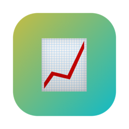
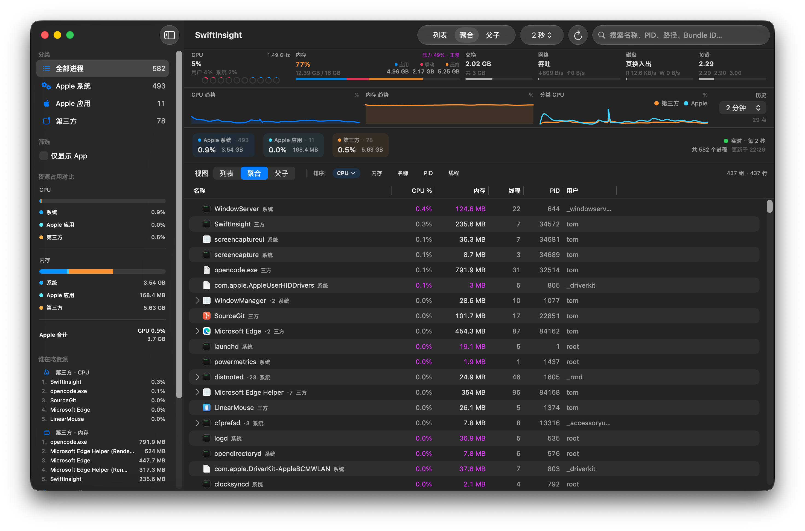
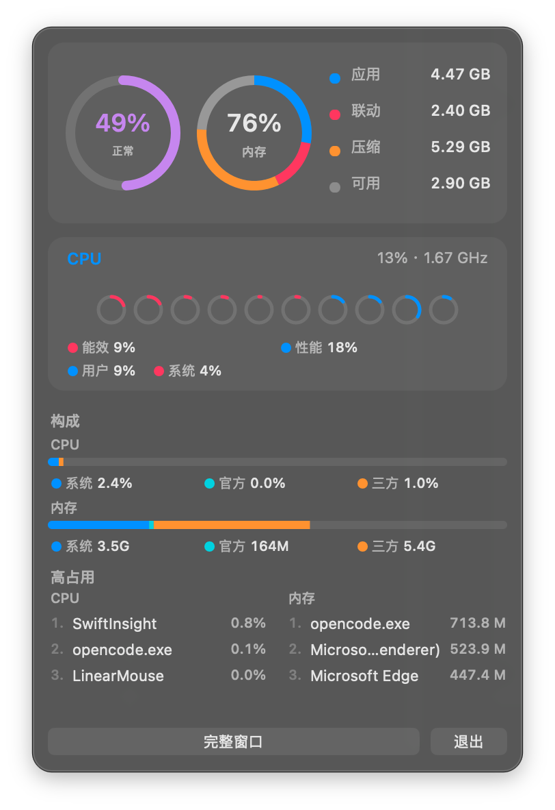

# SwiftInsight

[English](README.md) · 中文

<p align="center">
  
</p>

> 使用 Grok 4.5 / OpenCode Vibe Coding 而成。

macOS **活动监视器替代应用**（Swift / SwiftUI）。  
侧重：**Apple / 第三方资源对比**、稳定的**菜单栏面板**、**三轨刷新**降低空闲开销，以及可选的 **root Helper** 补全受限指标。

<p align="center">
  
</p>

<p align="center">
  
</p>

---

## 一览

| 模块 | 内容 |
|------|------|
| **进程** | 实时 CPU / 内存 / 线程 / 用户 / PID / 路径 / Bundle ID |
| **分类** | Apple 系统 · Apple 应用 · 第三方 |
| **视图** | 扁平列表 · 应用聚合树 · 父子进程树 |
| **系统条** | CPU（核、E/P）、内存（应用/联动/压缩）、压力、交换、网络、磁盘、负载 |
| **历史** | CPU / 内存 / 分类 CPU 曲线 |
| **菜单栏** | 迷你图标 + 毛玻璃面板；独立高占用模式/条数；可不打开主窗口常驻 |
| **刷新** | 三轨：**图标** / **面板** / **主窗口** — 独立间隔，空闲更省 |
| **启动** | 记住上次主窗口开/关；仅菜单栏启动无「先闪再藏」 |
| **设置** | 分组标签：通用 · 刷新 · 菜单栏 · Helper · 关于 |

---

## 功能

### 进程监控
- 搜索、分类筛选、排序、退出 / 强制退出、在 Finder 中显示  
- 按住 **⌃ Control** 仅暂停**主窗口**自动刷新（菜单栏采样不停）  

### 系统总览
- **CPU** — 用户/系统、每核小环（能效/性能着色），多核自动换行或竖条  
- **内存** — 应用 / 联动 / 压缩 / 可用  
- **内存压力** — 对齐活动监视器 jetsam（`kern.memorystatus_vm_pressure_level`）  
- 交换、网络吞吐、页换入出、负载  
- 安装特权 Helper 后可显示 **CPU 频率 / 温度**  

### 三轨刷新（低开销）
| 轨道 | 激活条件 | 采样内容 | 默认 | 可选 |
|------|----------|----------|------|------|
| **图标** | 主窗口关 **且** 面板关 | 仅系统 CPU + 内存（不枚举进程） | **3 s** | 2 / 3 / 5 / 10 s |
| **面板** | 面板开、主窗口关 | 精简指标 + 排名（不跑 root Helper） | **2 s** | 1 / 2 / 3 / 5 s |
| **主窗口** | 主窗口打开 | 完整列表、图表、详情；已装 Helper 时补全 | **2 s** | 1 / 2 / 5 / 10 s |

- 主窗口打开时，面板复用完整数据（不再单独跑面板定时器）  
- 关闭主窗口 / 面板会释放重数据，回落到更轻的轨道  
- 长时间运行通过 autorelease 池、缓存裁剪、面板懒加载、发布节流等抑制内存增长  

### 菜单栏
- 图标模式：**仅 CPU** · **仅内存** · **CPU + 内存** 双竖条（默认 CPU + 内存）  
- 面板：压力环 + 内存环、E/P 核心条、分类构成、CPU / 内存高占用  
- **高占用列表模式**与主窗口独立：**列表** · **聚合** · **父子**（默认列表）  
- **高占用条数**：每列 3–15（默认 **8**）  
- 区块卡片加深填充 + 细描边（明暗自适应，在毛玻璃底上更清晰）  
- 底部：完整窗口、退出，以及 **活动监视器 / 系统信息**（系统 App 图标）  
- 右键：打开主窗口、开机自启、版本号、GitHub、退出  
- 使用 `NSPanel` 定位 — 请用正式 **`.app`** 运行，不要用裸 `swift run` 测菜单位置  

### 窗口 / Dock / 启动
- 主窗口 **按需** 用 AppKit 创建；启动无 SwiftUI `WindowGroup` → 仅菜单栏时**不闪屏**  
- 关闭主窗口 = **隐藏**（不退出，菜单栏仍在）  
- 记住上次退出时主窗口是否可见（`launchMainWindowVisible`），下次启动按此恢复  
- 无主窗口 / 设置 / 关于时 **Dock 图标隐藏**  
- 再开：菜单栏「完整窗口」/ 右键 / 点 Dock / **⌘0**  

### 设置（分组标签）
| 标签 | 内容 |
|------|------|
| **通用** | 语言（跟随系统 / 中文 / English）· 主题 · **开机自启**（`SMAppService`） |
| **刷新** | 主窗口间隔 · Control 暂停说明 |
| **菜单栏** | 图标模式 · 图标间隔 · 面板间隔 · 高占用模式 · 条数 |
| **Helper** | 状态 · 安装 / 卸载（管理员密码）· 重新检测 |
| **关于** | 分类规则 · 说明 · 版本 · Bundle ID · MIT |

---

## 环境要求

- macOS **14+**  
- Xcode **15+**（或带 macOS SDK 的 Swift 5.9+）  
- 可选：[XcodeGen](https://github.com/yonaskolb/XcodeGen)（修改 `project.yml` 后重新生成工程）  

---

## 构建与运行

### 推荐（菜单栏 / 开机自启行为正确）

```bash
./scripts/run-app.sh          # Debug .app 并打开
./scripts/run-app.sh Release
```

不建议用于验证菜单栏：
- `swift run` — 无完整 bundle（图标 / 面板 / 登录项可能异常）  
- 把 `Package.swift` 当 macOS Application 打开  

### Xcode

```bash
xcodegen generate             # 仅在改过 project.yml 时
open SwiftInsight.xcodeproj
```

选 scheme **SwiftInsight** → Clean Build Folder → **⌘R**。  
Helper 会自动编进 `SwiftInsight.app/Contents/MacOS/`。

### SwiftPM（仅编译 / 逻辑）

```bash
swift build
swift run --product SwiftInsight
```

### 打本地 .app 包

```bash
./scripts/package-app.sh
open dist/SwiftInsight.app
```

同样会内嵌 `SwiftInsightHelper`（未 setuid）。

---

## 特权 Helper（可选）

部分系统保护进程对普通用户显示 **N/A**。Helper 以提权方式采样，并可提供 **频率 / 温度**。  
完整采样轨在已安装时会调用 Helper；轻量图标轨不会。

### 应用内安装（推荐，目标机无需源码）

1. 运行打包好的 **`.app`**（Xcode 或 `package-app.sh`）— Helper 已在包内。  
2. **设置 → Helper → 安装 Helper…**  
3. 输入管理员密码。  

安装位置：

```text
/usr/local/libexec/SwiftInsightHelper   # root:wheel，权限 4755（setuid）
```

可在同一设置区卸载，或：

```bash
sudo rm -f /usr/local/libexec/SwiftInsightHelper
```

### 终端安装（有现成 `.app` 即可，仍可不依赖源码）

```bash
./scripts/install-privileged-helper.sh \
  /path/to/SwiftInsight.app/Contents/MacOS/SwiftInsightHelper
```

> 仅建议本机自用。未做 App Store 公证分发。

---

## 项目结构

```text
Package.swift                 # SwiftPM
project.yml                   # XcodeGen → SwiftInsight.xcodeproj
SwiftInsight.xcodeproj/       # Xcode 工程（与 SPM 共享源码）
Sources/SwiftInsight/         # 主程序（SwiftUI + AppKit 菜单栏 / 主窗口）
Sources/SwiftInsightHelper/   # 特权采样助手
Resources/Assets.xcassets/    # 应用图标
scripts/                      # 运行 / 打包 / 安装 Helper
docs/                         # 截图与 logo
```

| | SwiftPM | Xcode / 打包 `.app` |
|--|---------|---------------------|
| 配置 | `Package.swift` | `project.yml` → `.xcodeproj` |
| 源码 | `Sources/` | 同左 |
| 产物 | 可执行文件 | `.app`（含内嵌 Helper） |
| 菜单栏 / 开机自启 | 能力有限 | **推荐** |

### 架构要点
- **AppSession** — 进程级 monitor / 菜单栏 / 偏好 启动  
- **MainWindowCoordinator** — 按需 `NSWindow`、启动偏好、Dock 策略  
- **ProcessMonitor** — 图标 / 面板 / 完整 三轨采样  
- SwiftUI 仅保留 Settings Scene；主界面需要时由 AppKit 承载  

---

## 许可证

[MIT](LICENSE) © 2026 [0x574859](https://github.com/WHYBBE) / [WHYBBE/SwiftInsight](https://github.com/WHYBBE/SwiftInsight)
